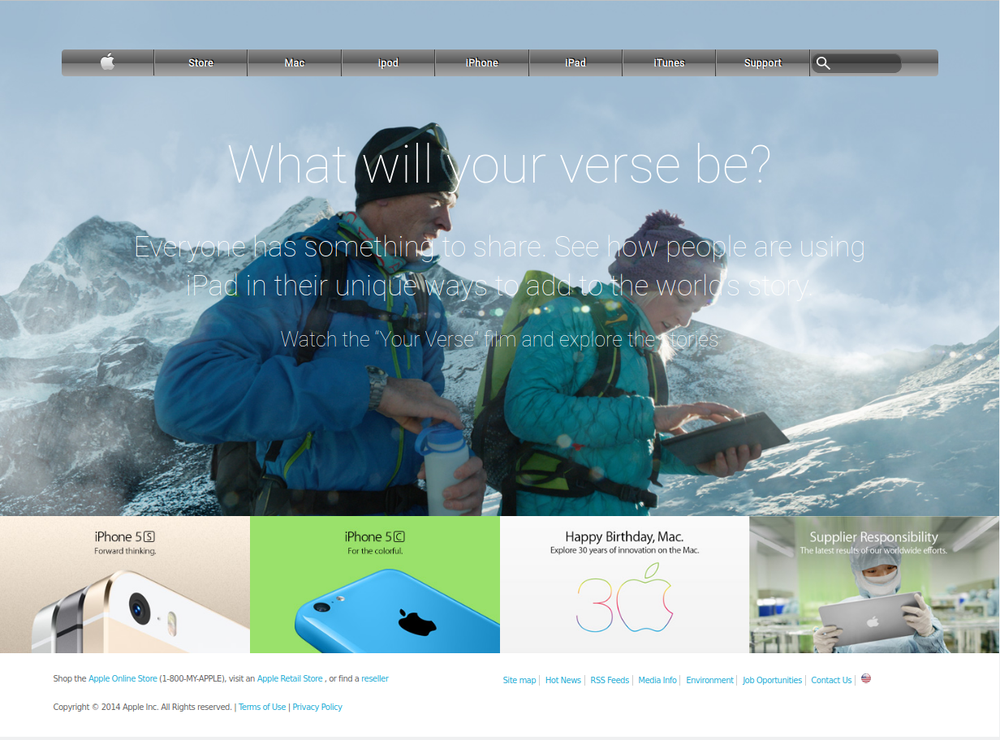

# Apple Webpage Clone Old Style

> This page is a clone of the Apple website a few years ago, the page was done as an exercise applying basic concepts of CSS grid, positioning, and background as image and gradient.

You can find the file online at this [link](https://web.archive.org/web/20140301004610/http://www.apple.com/).

## Built With

- HTML
- CSS

## Live Demo

[Live Demo Link](https://meme-es.github.io/oldstyle-applewebpage/)

## Authors

👤 **Manuel**

- Github: [@meme-es](https://github.com/meme-es)
- Twitter: [@meme_es](https://twitter.com/meme_es)
- Linkedin: [linkedin](https://www.linkedin.com/in/manuel-elias-b289a638/)

## 🤝 Contributing

Contributions, issues and feature requests are welcome!

Feel free to check the [issues page](https://github.com/meme-es/oldstyle-applewebpage/issues).

## Show your support

Give a ⭐️ if you like this project!

## 📝 License

This project is free licensed.
